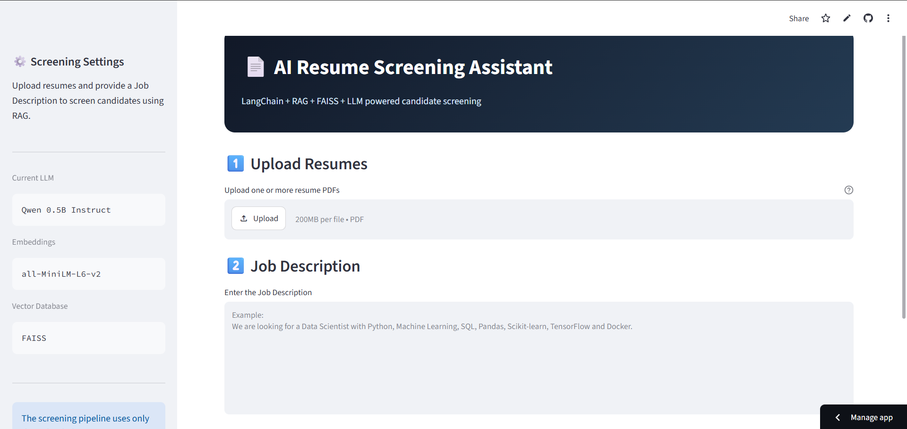

# AI Resume Screening Assistant --- RAG + LangChain

An AI-powered **resume screening and candidate ranking system** that
uses **RAG, semantic search, and a local LLM** to evaluate resumes
against a Job Description.

 **[Live Streamlit
Demo](https://ai-resume-screening-assistant-rag-langchain-4kkvqwmjm92h2jmfwo.streamlit.app/)**\
**[GitHub
Repository](https://github.com/ARCHITTOMAR15/ai-resume-screening-assistant-rag-langchain)**

<p align="right">
  
</p>


------------------------------------------------------------------------

##  Key Features

-    Upload **multiple resume PDFs**
-    Enter a **Job Description**
-    Retrieve relevant resume content using **semantic search**
-    Evaluate candidates using a **local Qwen 0.5B Instruct LLM**
-    Generate a **0--100 match score**
-    Identify **matching skills**
-    Identify **missing skills**
-    Rank candidates by match score
-    Generate **Hire / Shortlist / Reject** recommendations
-    Deployed using **Streamlit**

------------------------------------------------------------------------

##  RAG Architecture

``` text
       Resume PDFs
            │
            ▼
       PDF Loading
       PyPDFLoader
            │
            ▼
      Text Chunking
     500 / 100 overlap
            │
            ▼
       Embeddings
   all-MiniLM-L6-v2
            │
            ▼
      FAISS Vector Store
            │
            ▼
    Semantic Retrieval
            │
            ├──────────────┐
            │              │
            ▼              ▼
    Job Description    Resume Context
            │              │
            └───────┬──────┘
                    ▼
              Prompt + LLM
                    │
                    ▼
             Qwen 0.5B
                    │
                    ▼
          Structured Output
              Pydantic
                    │
                    ▼
          Candidate Ranking
                    │
                    ▼
             Streamlit App
```

------------------------------------------------------------------------

##  How It Works

### 1. Resume Processing

PDF resumes are loaded with **PyPDFLoader**, and candidate metadata is
attached to each document.

### 2. Semantic Retrieval

Resume chunks are converted into embeddings using:

**`sentence-transformers/all-MiniLM-L6-v2`**

and indexed using **FAISS**.

The Streamlit application performs **candidate-specific similarity
retrieval** so that resumes are evaluated independently.

### 3. LLM Evaluation

A local **Qwen 0.5B Instruct** model evaluates the retrieved resume
context against the Job Description.

### 4. Structured Output

The response is validated using **Pydantic**:

``` text
Match Score
Matching Skills
Missing Skills
Recommendation
```

Recommendations are restricted to:

`Hire` · `Shortlist` · `Reject`

------------------------------------------------------------------------

------------------------------------------------------------------------

##  Tech Stack

**Python** · **LangChain** · **RAG** · **FAISS** · **Hugging Face
Transformers** · **Sentence Transformers** · **Qwen 0.5B Instruct** ·
**Pydantic** · **PyPDFLoader** · **Streamlit**

------------------------------------------------------------------------
## What This Project Demonstrates

**PDF Processing → RAG → Embeddings → Vector Search → LLM → Structured
Output → Candidate Ranking → Deployment**

This project demonstrates how RAG can be used to build a practical
**GenAI recruitment application** rather than simply creating a
conversational chatbot.

------------------------------------------------------------------------

##  Author

**Archit Tomar**

AI/ML · Generative AI · RAG · LangChain · NLP · Transformers

**[GitHub](https://github.com/ARCHITTOMAR15)**

------------------------------------------------------------------------

⭐ If you find this project useful, consider giving the repository a
star.
